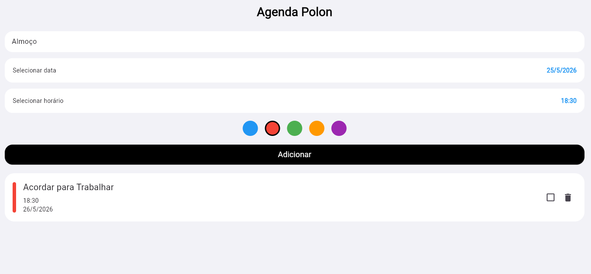
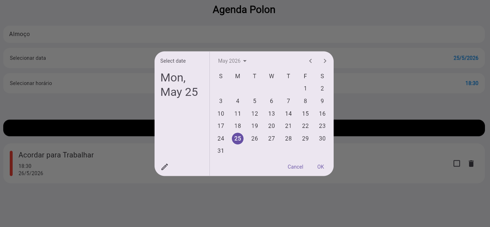
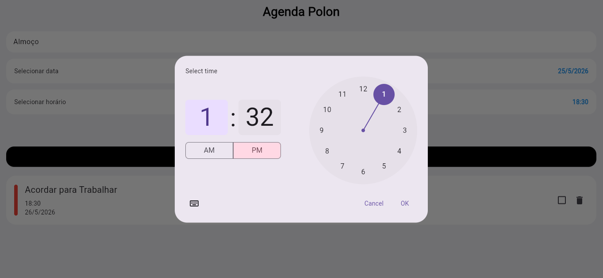

# Agenda Flutter

Aplicativo de gerenciamento de tarefas desenvolvido em Flutter utilizando Dart.

# Funcionalidades

* Cadastro de tarefas
* Seleção de data
* Seleção de horário
* Organização visual por cores
* Alteração de status
* Exclusão de tarefas

# Tecnologias utilizadas

* Flutter
* Dart
* Material Design

# Screenshots

# Tela inicial

# DATA

# HORA

# LEMBRETE

Projeto desenvolvido para prática de desenvolvimento mobile, lógica de programação e construção de interfaces modernas utilizando Flutter.

# Autor

Guilherme Silva Polonio
